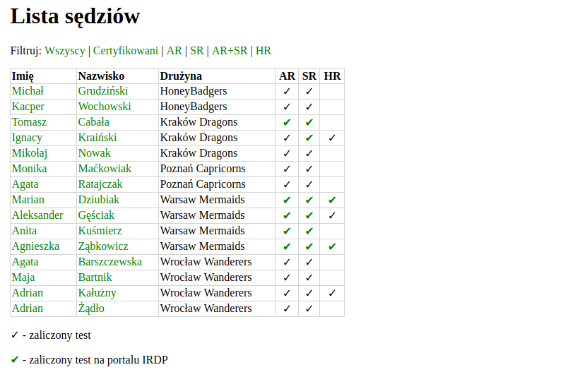

# Referee Testing Environment for the Polish Quidditch League

This is the source code for the PLQ's referee testing portal which you can visit here: <https://ref.polskaligaquidditcha.pl>

It's a ASP.NET Core MVC application (used to be in F# with Suave), made with security in mind. If you find any bugs, please submit an Issue, describing when, what happens.

## The core functionalities are there

- [x] User can login
- [x] User can register
- [x] User can take a test
- [x] User can viewtheir profile
- [x] User can edit their profile
- [x] User can browse the referee catalog
- [ ] Admin has an easier life managing tests and users - can be achieved by simply editing the database with phpMyAdmin or similar

## Screenshots
Index page

Referee directory

Register page

Profile page

SR test - user can take the test

AR test - user is in the cooldown period

Starting a test

Taking a test

